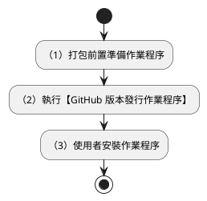
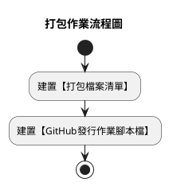
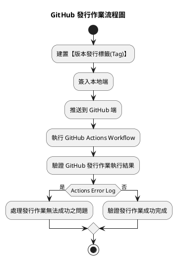
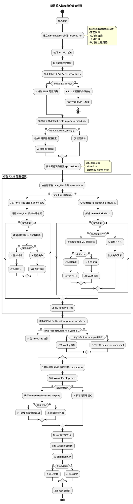

# 版本發行作業指引

以下說明【閩拚輸入法】之版本發行作業程序，及執行時期之查驗要點。

1. 打包前置準備作業程序
2. 執行【GitHub 版本發行作業程序】
3. 使用者安裝作業程序

## 作業流程



## （1）打包前置準備作業程序



### 建罝【打包檔案清單】

建置一清單，描述即將發行之版本，該發行套件包中（壓縮檔案），應包含之檔案及目錄。

```powershell
# --- 共用函式庫/工具 ---
keymap_piau_tian.yaml
bp_libs_hst_phing_im.yaml
bp_libs_hst_zu_im.yaml
bp_libs.yaml
custom_phrase.txt
rime.lua

# --- 鍵盤按鍵練習工具 ---
bp_kb_zu_im.schema.yaml

# --- 【閩拼方案輸入法】 ---
bp_hong_im.schema.yaml
bp_phing_im.schema.yaml
bp_ji_khoo.dict.yaml

# 其他檔案...
requirements.txt
packing_list.txt
rime_install.exe
```

### 建置【GitHub發行作業腳本檔】

建置 GitHub Actions Workflow: release-yamls.yml YAML Script
，使 GitHub 在收接獲【版本標籤(Tag)】推送要求時，便觸發 GitHub 之發行(Release)作業。完成 GitHub 專案産品之發行。

```powershell

```


## （2）執行【GitHub 版本發行作業程序】



## （3）使用者安裝作業程序

1. 程式初始化

    - 建立 RimeInstaller 實例
    - 智能檢測資源目錄位置（當前目錄、執行檔目錄等）

2. RIME 安裝檢查

    - 檢查 RIME 配置目錄是否存在
    - 如果不存在則提示安裝 RIME 小狼毫

3. 備份現有檔案

   - 備份 default.custom.yaml
   - 備份 rime.lua 和 custom_phrase.txt

4. 複製 RIME 配置檔案

   - 檢查是否有 rime_files 目錄
   - 如果有：從 rime_files 目錄複製所有檔案
   - 如果沒有：從 release-include.txt 指定的檔案列表複製

5. 複製 default.custom.yaml

   - 優先從 rime_files 目錄複製
   - 回退到 config 目錄

6. RIME 重新部署

   - 搜尋並執行 WeaselDeployer.exe
   - 觸發 RIME 重新部署

7. 完成報告

   - 顯示安裝統計
   - 提供後續步驟說明




## 參考
